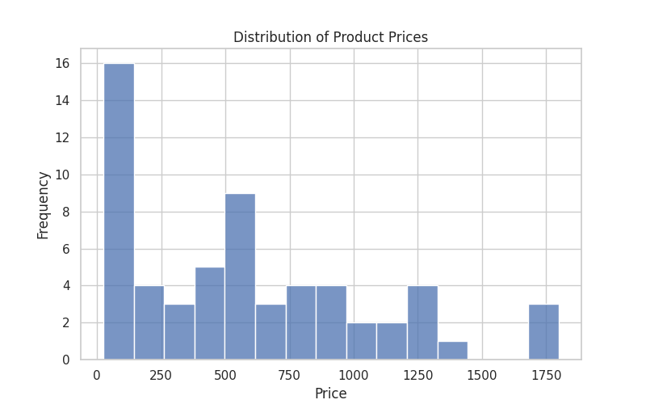
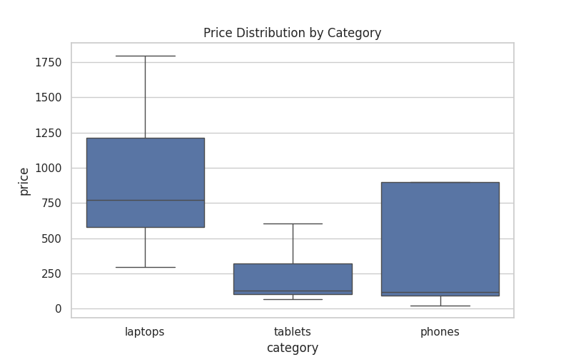
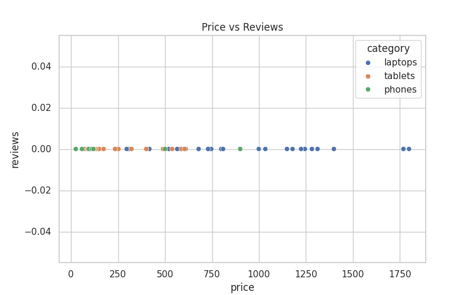

# E-Commerce Price Intelligence

Collecting product data through web scraping and analyzing pricing patterns across
categories — built as a complete data collection-to-insight pipeline.

---

## Data Collection

Data was scraped from [webscraper.io test e-commerce site](https://webscraper.io/test-sites/e-commerce/static) — a legal, publicly available practice site that mimics real marketplace HTML structure. No static CSV was used; the dataset was built from scratch using a custom scraping script.

| Attribute | Detail |
|-----------|--------|
| Source | webscraper.io (practice e-commerce site) |
| Categories scraped | Laptops, Tablets, Phones |
| Total products | 60 products |
| Fields collected | product_name, price, description, reviews, category |
| Scraping tool | Python · BeautifulSoup · Requests |

---

## Tools

- **Scraping:** Python, BeautifulSoup, Requests
- **Analysis:** Pandas, NumPy
- **Visualization:** Matplotlib, Seaborn
- **Environment:** Jupyter Notebook

---

## Workflow

This project covers the full analyst workflow — from raw HTML to business insight.

**1. Scraping** — Custom script targets product listings across 3 categories and exports raw data to CSV.

**2. Cleaning** — Removed duplicates, standardized price format (stripped `$` symbol, cast to float), handled missing values.

**3. Analysis** — Price distribution per category, price range comparison, category-level pricing patterns.

---

## Key Findings

**Laptops are the highest-priced category by a wide margin.** Average laptop price
is $900.12 — more than double phones ($400.66) and nearly 4x tablets ($232.04).

**The overall price range is $24.99 to $1,799.00 with a median of $529.49.**
This wide spread is driven almost entirely by the laptop category, which pulls the
median upward.

**Tablets are the most affordable category.** At an average of $232.04, they sit
well below the dataset median — making them the entry-level segment in this market.

**Price distribution is right-skewed.** Most products cluster in the $24.99–$529
range, with a long tail of premium laptops pushing toward $1,799.

---

## Visuals





---

## Project Structure
```
ecommerce-price-analysis/
│
├── data/
│   └── ecommerce_data.csv        # Scraped dataset
│
├── scraper/
│   └── scraper.py                # Web scraping script
│
├── notebook/
│   └── price_analysis.ipynb      # Full analysis notebook
│
├── visuals/
│   ├── price_distribution.png
│   └── category_comparison.png
│
└── README.md
```

---

## How to Run
```bash
# Clone the repo
git clone https://github.com/Arnoldew/ecommerce-price-analysis.git
cd ecommerce-price-analysis

# Install dependencies
pip install pandas numpy matplotlib seaborn requests beautifulsoup4 jupyter

# (Optional) Re-run the scraper to collect fresh data
python scraper/scraper.py

# Launch the analysis notebook
jupyter notebook notebook/price_analysis.ipynb
```

---

## Author

**Arnoldew Ray Ruby**
- GitHub: [@Arnoldew](https://github.com/Arnoldew)
- LinkedIn: [arnoldew-ray-ruby](https://www.linkedin.com/in/arnoldew-ray-ruby/)

---

*Part of a 10-project data analyst portfolio.*
